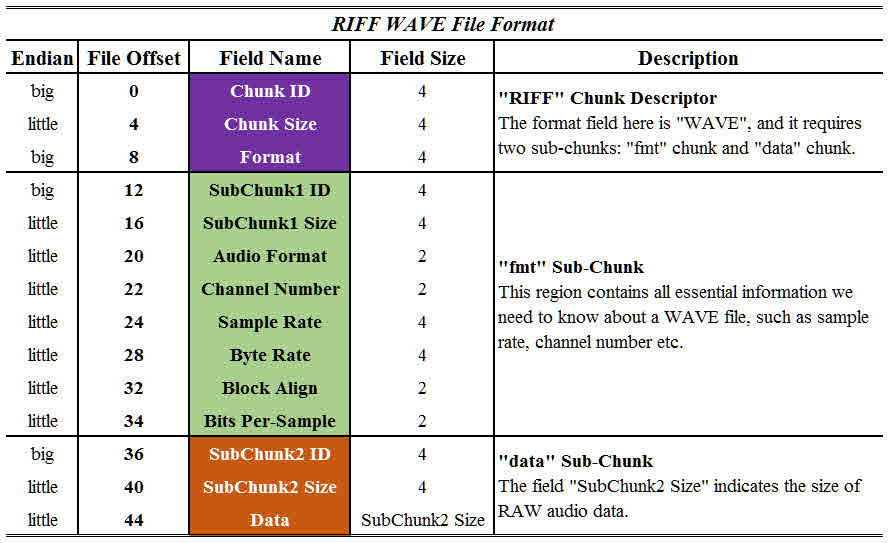

# waveファイルの仕様
waveファイルは以下のような仕様になっています.

WAVEファイルは3つのチャンクから構成されています.
()内に書かれているのは、実際の構造体メンバ名です. 

### RIFFチャンク
RIFFチャンクは以下3つの要素で構成されています.
* Chunk ID (data.rc.chunk_id)  
"RIFF"という4文字が入っています.

* ChunkS ize (data.rc.chunk_size )  
データサイズからchunk IDとFormatを引いた値を代入します.(36 + 音源データサイズ)

* Format (data.rc.format_type)  
"WAVE"という4文字が入ります.

### FMTチャンク
* SubChunk1ID (data.fc.chunk_id)  
"fmt "という4文字（最後に半角空白）が入ります.

* SubChunk1Size (data.fc.chunk_size)  
PCMでは16が入ります.（idとsizeを除くデータ数）

* Audio Format (data.fc.format_type)  
PCMでは1が入ります.

* Channel Number (data.fc.channel)  
チャンネル数です. 今回はモノラルなので1とします.

* Sample Rate (data.fc.sample_per_sec)  
サンプリング周波数です.

* Byte Rate (data.fc.bytes_per_sec)  
Sample Rate * Block Align  
= Sample Rate * Bits Per-Sample * Channel Number / 8;  
で求めらます.

* Block Align (data.fc.block_size)  
Bits Per-Sample * Channel Number / 8;  
で求められます.

* Bits Per-Sample (data.fc.bits_per_sample)  
量子化ビット数です.

### DATAチャンク
* Subchunk2ID (data.dc.chunk_id)  
"data"の4文字が入ります.

* Subchunk2Size (data.dc.chunk_size)  
Subchunk2IDとSubchunk2Sizeを除いたDATAチャンクのサイズです.

* Data  
音声データが格納されています.